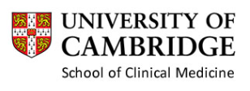

## A database of the human placenta transcriptome

> This is a [Shiny](https://shiny.rstudio.com) web application to browse the human placenta transcriptome based on the [POP study](https://www.obgyn.cam.ac.uk/research/pops-2/).

> It is developed and maintained by the [Department of Obstetrics & Gynaecology](https://www.obgyn.cam.ac.uk/)

> [School of Clinical Medicine](https://www.medschl.cam.ac.uk/)

> [University of Cambridge](https://www.cam.ac.uk/)

